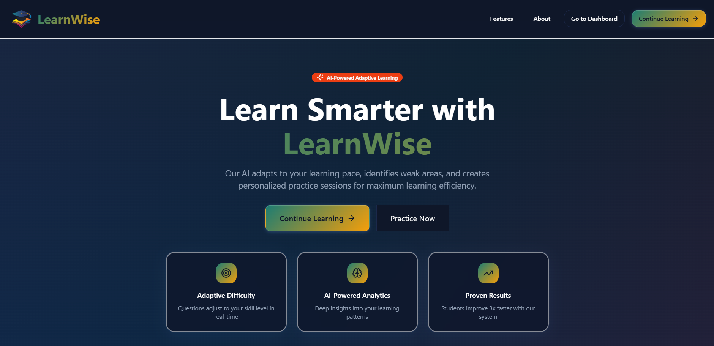
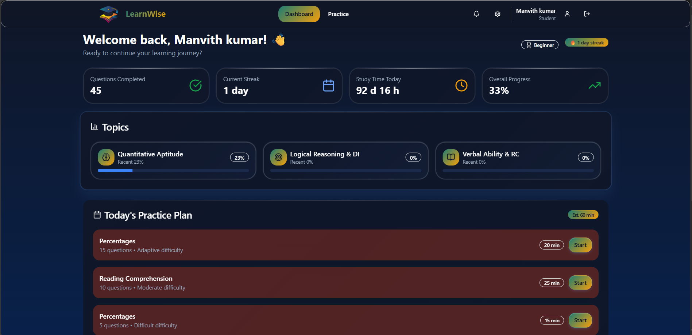

# LEARNWISE

_Empowering Learning Through Intelligent, Seamless Innovation_


---
Live Website - https://learnwise-xi.vercel.app/
---

## 🚀 Built with the tools and technologies:


---

## 📖 Overview

**Learnwise** is an adaptive, AI-powered learning platform built for modern learners.  
It provides an intuitive and seamless environment for students to practice, learn, and track their progress with cutting-edge tools and technologies.

---

## ✨ Features

- 📚 **Adaptive Learning**: Personalized question difficulty based on learner performance.  
- ⚡ **Real-Time Assessment**: Track progress instantly with detailed feedback.  
- 🎯 **Placement Prep**: Focused sections on Quantitative Aptitude, Logical Reasoning, Data Interpretation, and Verbal Ability.  
- 👨‍🏫 **Teacher & Admin Dashboard**: Manage question banks and student performance.  
- 🎮 **Gamified Learning**: Streaks, points, and leaderboards to boost motivation.  

---

## 🛠️ Tech Stack

- **Frontend**: React, TypeScript, Vite, ESLint, React Hook Form  
- **Styling**: PostCSS, Autoprefixer  
- **Validation**: Zod  
- **Utilities**: date-fns  
- **Package Manager**: npm  

---

## ⚙️ Installation

Clone the repository:

```bash
git clone https://github.com/Manvith-kumar16/Learnwise.git
cd Learnwise
````

Install dependencies:

```bash
npm install
```

Run the development server:

```bash
npm run dev
```

---

## 📂 Project Structure

```
Learnwise/
├── public/          # Static assets
├── src/             # Source code
│   ├── components/  # Reusable UI components
│   ├── pages/       # Application pages
│   ├── hooks/       # Custom hooks
│   ├── utils/       # Helper functions
│   └── styles/      # Global styles
└── package.json     # Project metadata
```

---

## 📸 Screenshots / Demo







---


## 📜 License

This project is licensed under the **MIT License**.
See the [LICENSE](./LICENSE) file for details.


